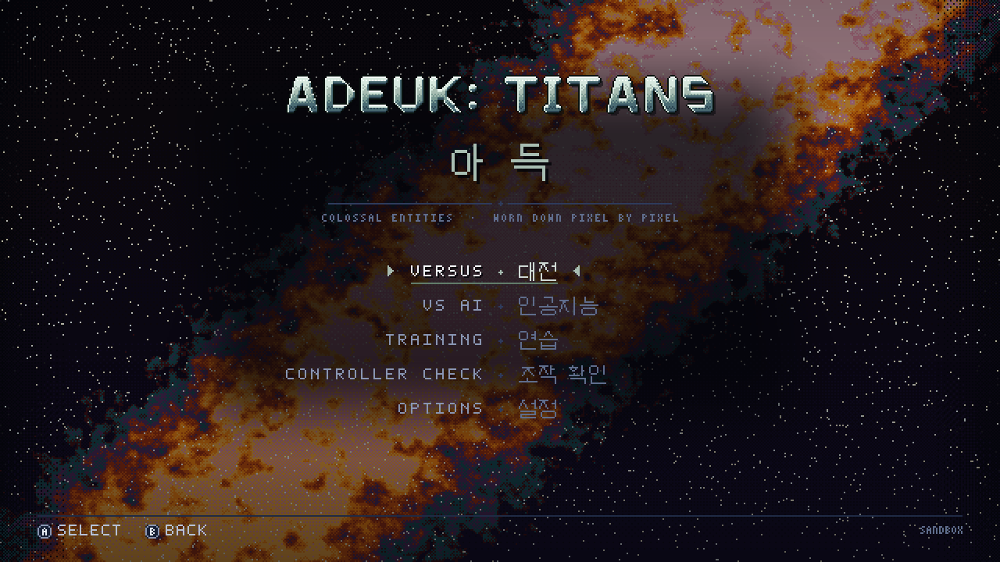
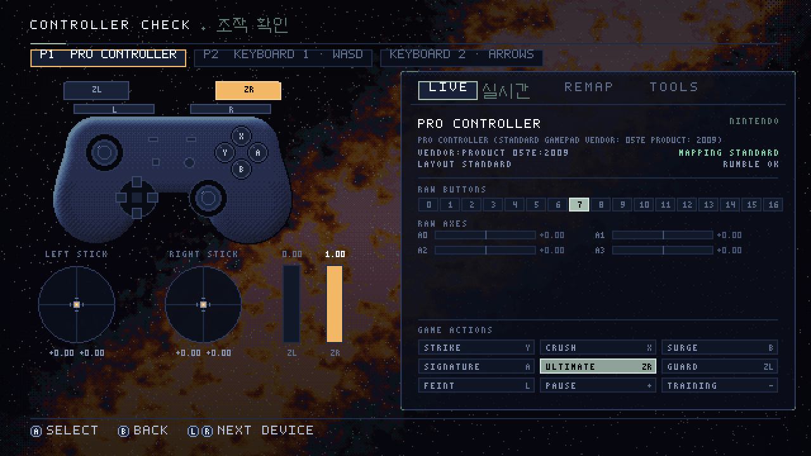

# ADEUK: TITANS

**A cosmic pixel-art fighting game for the browser, where colossal entities physically wear each other down.**
There is no health bar to drain: every titan's body is a simulated map of pixel matter, and damage removes, burns, infects,
cracks, crushes or devours the actual pixels, each in the attacker's own way. A fight leaves both bodies visibly carved and the
arena littered with what came off them.

Nothing is downloaded at runtime. Every sprite, sound and font (including the Hangeul) is generated in code.



*The UI over a stand-in nebula backdrop (screenshot from the UI sandbox, not from a live match).*

## Contents

- [Play](#play)
- [How to play](#how-to-play)
- [Controls](#controls)
- [Using a Switch Pro Controller](#using-a-switch-pro-controller)
- [Browser support](#browser-support)
- [Troubleshooting](#troubleshooting)
- [Development](#development)
- [Deploying to GitHub Pages](#deploying-to-github-pages)
- [What is verified, and what is not](#what-is-verified-and-what-is-not)
- [Credits](#credits)

## Play

Open the deployed page (`https://<owner>.github.io/<repo>/` once the Pages workflow has run, see
[Deploying](#deploying-to-github-pages)), or run it locally:

```bash
npm ci
npm run dev        # http://localhost:5173
```

Node 20 or newer. Click the page or press any key or button once: browsers only start audio after a gesture.

## How to play

Two titans, one arena, best of three rounds. Each round is a two-second intro, up to 90 seconds of fighting, and a KO. If time
runs out the titan with more of itself left wins.

**Destruction is health.** The titan's HUD portrait is a live thumbnail of what remains of it, with a ghost of the silhouette it
started with. Losing matter also changes how a titan fights: lighter and faster, but weaker. Damaged regions hit less hard, so
carve toward the core.

| Move | What it is |
|---|---|
| **Strike** | Light, fast, safe-ish. Aim it with the left stick. |
| **Crush** | Heavy and slow to land; sustained Crush breaks a Guard. Vast, and it commits you. |
| **Surge** | Drift or dash with a brief moment of intangibility. |
| **Signature** | The titan's own trick, often hold-to-charge (the Last One's Gaze, the Asteroid's Swarm). |
| **Ultimate** | Spends the meter, which fills from dealing and from receiving damage. |
| **Guard** | A shell whose strength depends on the damage type against its material. |
| **Feint** | Cancel a windup into Guard or Surge in its first 40 %. |

Modes: **Versus** (two players, one screen), **VS AI** (six difficulty levels, "Titan" being the top), **Training** (frame data,
hitboxes and matter overlays, no clock, no KO) and, after a minute idle on the title screen, an AI-versus-AI attract mode.

**Titans.** Six are designed; the roster screen shows which are playable in this build and greys out the rest.

| Titan | Destroys by | Sounds like |
|---|---|---|
| The Last One | FRACTURE: shears along the weakest bonds, chunks tumble off | struck glass and ceramic |
| The Asteroid | KINETIC: ballistic craters, ejecta and shrapnel that bursts later | rock, iron and a whistle |
| The Nexus, Black Hole, Supernova, Planet | assimilation, tidal, thermal, crush and tectonics | see `docs/TITANS.md` |

## Controls

Default layout, in **Nintendo positions**. Xbox and PlayStation pads use the same physical positions, so muscle memory carries
over; only the printed letters on the on-screen prompts change.

```
    ZL ▄▄▄  L                             R  ▄▄▄ ZR
   ┌────────────────────────────────────────────┐
   │   ( left stick )     −   +        (X)      │      Y  Strike            L / R  Feint (cancel)
   │                      ◘   ⌂      (Y)  (A)   │      X  Crush             ZL     Guard
   │      ▲                            (B)      │      B  Surge             ZR     Ultimate
   │    ◄   ►             ( right stick )       │      A  Signature         +      Pause
   │      ▼                                     │      −  Training overlay
   └────────────────────────────────────────────┘      Stick / D-pad: move and aim
                                                       Menus: A confirms, B goes back, L / R change tab or device
```

| | Switch Pro | Xbox | PlayStation |
|---|---|---|---|
| Strike | Y (left) | X | Square |
| Crush | X (top) | Y | Triangle |
| Surge | B (bottom) | A | Cross |
| Signature | A (right) | B | Circle |
| Ultimate | ZR | RT | R2 |
| Guard | ZL | LT | L2 |
| Feint | L / R | LB / RB | L1 / R1 |
| Pause / Training | + / − | Menu / View | Options / Share |

**Single Joy-Con, held sideways** (one player per Joy-Con): the stick is rotated for you, and since ZL/ZR are out of reach
**SL = Guard** and **SR = Ultimate**; L/R still feint, and the small − / + / Capture / Home buttons pause and toggle training.

**Keyboard**, two players on one board. Keys are matched by physical position, so AZERTY, QWERTZ and Dvorak get the same shape.

| | Move | Strike | Crush | Surge | Signature | Ultimate | Guard | Feint | Pause | Training |
|---|---|---|---|---|---|---|---|---|---|---|
| **P1** | W A S D | J | I | K | L | O | Shift / Space | Q / E | Esc | Tab |
| **P2** | arrow keys | Num 4 | Num 8 | Num 2 | Num 6 | Num 9 | Num 0 | Num 7 / 1 | Enter | Num − |

Menus: arrows or WASD, Space or Enter to confirm, Backspace or Esc to go back. P2's keys need a numpad.

Everything is remappable on the **Controller Check** screen (title menu, or Options, or the pause menu). The Options screen also
has button-label style (Auto / Nintendo / Xbox / PlayStation), *Confirm by label* (Nintendo A is the right button) or *by
position* (always the bottom button), stick deadzone, rumble strength and graphics quality.



*Controller Check with ZR held. This screenshot comes from the browser tests, which drive the game with a simulated Pro Controller.*

## Using a Switch Pro Controller

The Pro Controller is the first-class device. It needs no driver or app, only Bluetooth.

**Pair it once.** Press and hold the small round *sync* button on the top edge between the shoulder buttons until the four player
LEDs sweep back and forth, then:

| OS | Where |
|---|---|
| **Windows 10/11** | Settings → Bluetooth & devices → Add device → Bluetooth → *Pro Controller* |
| **macOS** | System Settings → Bluetooth → *Pro Controller* → Connect |
| **Linux** | Your desktop's Bluetooth settings, or `bluetoothctl` (`scan on`, `pair <MAC>`, `trust <MAC>`, `connect <MAC>`). Kernel 5.16+ ships the `hid-nintendo` driver, which gives the best result |
| **ChromeOS / Android** | Settings → Connected devices → Pair new device |

**Joy-Cons** pair the same way, one at a time; each is its own player. Some systems present a docked pair or a charging grip as a
single combined pad, which also works.

**Then press any button on the page.** This is a browser rule, not a bug: the Gamepad API hides a controller until it is first
used, so the game cannot know it is there until you press something. The prompts on screen switch to Nintendo glyphs.

**Using Steam?** Steam Input may claim the controller and present it to the browser as an Xbox pad. That still works (the game
goes by position), but the prompts will show Xbox letters and, with Steam's "Nintendo layout" on, A and B may feel swapped. Set
*Options → Button labels* and *Confirm button* to taste, or quit Steam / disable Steam Input for the browser.

**Rumble** uses the browser's dual-rumble effect where the browser and OS support it. For the Pro Controller's HD rumble there is
an optional **WebHID** mode (Controller Check → Tools → WebHID, Chrome or Edge only, needs a click and a permission prompt). It
is off by default and degrades silently to the normal path.

**If a button lights the wrong thing**, open **Controller Check**: it shows the raw button and axis numbers the browser reports,
lights the matching position on a picture of the pad, and lets you rebind any action in a few seconds. Remaps are stored per
controller model in `localStorage`. The Tools tab has stick calibration, a stick-rotation wizard and a rumble test.

## Browser support

| Browser | Gamepad | Rumble | WebHID | Audio | Notes |
|---|---|---|---|---|---|
| Chrome / Edge (desktop) | yes | where the OS exposes it | optional | yes | the primary target |
| Firefox (desktop) | yes | limited | no | yes | non-standard button tables are handled; Firefox reports the pad only after a press |
| Safari (macOS) | yes | limited | no | yes | audio needs a click or key first |
| Mobile browsers | partial | varies | no | yes | no touch controls yet: a pad or keyboard is required |

This table is the intended support, written from documentation. See [What is verified](#what-is-verified-and-what-is-not).

## Troubleshooting

- **The pad is connected but the game does not see it.** Press a button on the page. If it still does not appear, reload the
  page with the pad already on, and check that no other app (Steam, an emulator, a Remote Play client) has grabbed it.
- **No sound.** Click or press a key once. On a gamepad-only setup some browsers do not count a pad press as a gesture; the
  first click, key press or touch starts the sound.
- **A and B are swapped.** Options → Confirm button: *by label* or *by position*.
- **A stick drifts or a direction is dead.** Controller Check → Tools → Calibrate stick, and raise the deadzone in Options.
- **A sideways Joy-Con steers the wrong way.** Controller Check → Tools → Orient stick, then push the stick away from you.
- **It runs slowly.** Options → Graphics quality. The renderer is GPU-based; a software-GL browser will struggle.
- **Something is very wrong with saved settings.** They are ignored if unreadable, but you can clear the site's data (the keys are
  `adeuk.input.v1` and `adeuk.ui.v1`).

## Development

```bash
npm ci
npm run dev          # Vite dev server
npm run typecheck    # tsc --noEmit
npm run lint         # eslint + prettier --check
npm test             # vitest (unit tests, in Node)
npm run build        # typecheck, then a production build to dist/
npm run e2e          # Playwright (Chromium): builds, previews, and runs e2e/*.spec.ts
npm run perf         # frame-time measurements
npm run capture      # screenshots of the game at set states
npm run balance      # headless AI tournament
```

Playwright needs a Chromium: `npx playwright install --with-deps chromium` (CI does this; in the dev sandbox one is preinstalled).

**Layout**

| Path | What |
|---|---|
| `src/contracts` | The typed contracts every module obeys |
| `src/matter`, `src/titans`, `src/combat`, `src/ai`, `src/sim` | The pure, deterministic simulation (no DOM) |
| `src/render`, `src/stages` | Three.js scenery rendered small and dithered, and the compositor |
| `src/input` | Gamepad and keyboard input, the Switch Pro layer, Controller Check backend |
| `src/ui` | The in-pixel UI and HUD, Latin and Hangeul fonts, every screen |
| `src/audio` | The procedural WebAudio engine: voices, adaptive score, limiter |
| `dev/*` | Sandboxes and audition pages (Vite serves them in dev; they are not in the build) |
| `tools/*` | Command-line tools (screenshots, sheets, verification runs) |
| `e2e/*.spec.ts` | Browser tests |
| `docs/` | Design bible, decisions, per-module notes, proposals, gallery |

Each module has its own `README.md` (public API, invariants, tuning knobs, how to test).

**Sandboxes worth knowing** (with `npm run dev`, then open `/dev/ui/…`):

- `/dev/ui/index.html?screen=controller` : the real input manager, UI and audio engine over a stage backdrop, no simulation. Any
  screen by name (`title`, `mode`, `assign`, `select`, `stage`, `controller`, `options`, `pause`, `results`, `attract`), or `?hud=1`.
- `/dev/ui/audio.html` : every sound on a button, with the score's stage / phase / intensity controls, volume, and a live level
  meter. Put on headphones. The "Run OfflineAudioContext verification" button reproduces the numeric checks in the browser.

**Useful commands for the UI, input and audio work**

```bash
npx tsx tools/ui/sheet.ts            # render every UI screen to .scratch/ui/*.png (Node, no browser)
npx tsx tools/ui/audio-verify.ts     # numeric audio verification in headless Chromium (--quick, --titans, --stages, --body, --json)
npx vitest run src/input src/ui src/audio
npx playwright test e2e/controller.spec.ts e2e/ui.spec.ts e2e/ui-audio.spec.ts
```

The browser specs drive the input layer with **fake gamepads** (a replacement `navigator.getGamepads`, `tools/ui/e2e-fake-pads.ts`)
and write screenshots to `.scratch/e2e/`.

## Deploying to GitHub Pages

`.github/workflows/pages.yml` builds the game (`vite build`, with `base: './'` so it works under `https://<owner>.github.io/<repo>/`)
and deploys `dist/` on every push to `main`. **One-time setup, or it will fail with a 404 at the deploy step:**

> Repository → **Settings → Pages → Build and deployment → Source: _GitHub Actions_**

`.github/workflows/ci.yml` runs on every push and pull request: typecheck, lint, unit tests and build in one job; the Playwright
browser tests (Chromium, with the screenshots and report uploaded as artifacts) in another.

## What is verified, and what is not

Read this before you rely on the controller layer.

- **Verified against fake gamepads only.** No physical Switch Pro Controller, Joy-Con, Xbox or PlayStation pad, and no Bluetooth
  stack, exists in the build environment. Everything the input layer does is tested against objects shaped like the browser's
  `Gamepad` (unit tests and Playwright), written from documented browser behaviour: id formats, mapping strings, button and axis
  counts, the DirectInput-style button order (B A Y X L R ZL ZR − + L3 R3 Home Capture), the D-pad hat on axis 9, the Joy-Con
  SL/SR indices and stick rotation, and `vibrationActuator`. **Each of these still needs ten minutes on real hardware.** The
  Controller Check screen exists so the difference between the tables and reality is visible and fixable by any player.
- **WebHID** report parsing and the HD-rumble encoder are written from the community's reverse-engineered protocol notes and have
  never talked to a real controller. They are off unless you turn them on.
- **Audio has been measured, not heard.** The engine is rendered offline in headless Chromium and checked for clipping, NaN,
  audibility, latency, adaptive-score response, volume law and tail lengths (`e2e/ui-audio.spec.ts`), and that pass found and fixed
  real bugs. It cannot tell you a chord is beautiful. Whether a gamepad press unlocks audio differs by browser.

## Credits

Design, code, pixel art and sound are all procedural and original to this repository; no third-party art, audio, fonts or
generated assets are included. Runtime dependency: [three.js](https://threejs.org/). Tooling: Vite, Vitest, Playwright, TypeScript,
ESLint, Prettier.

No licence has been chosen yet.
